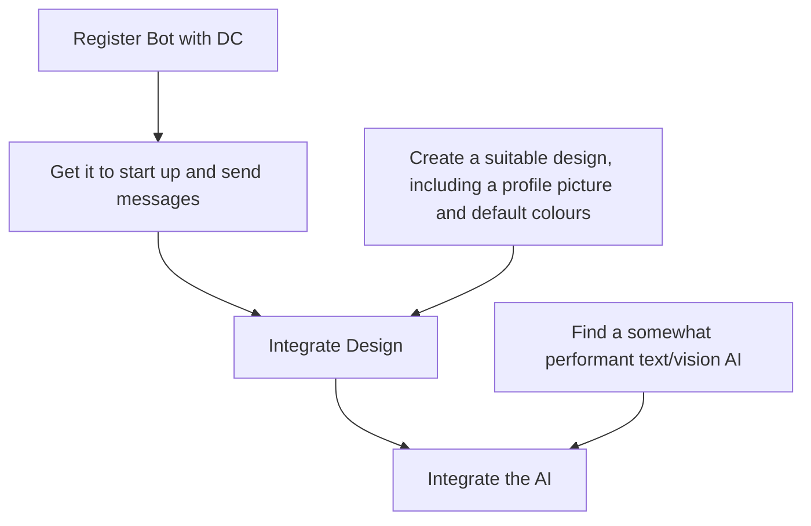

# discord-ai

## Roadmap

```mermaid
graph TD;
    A["Register Bot with DC"] --> B["Get it to start up and send messages"] --> E["Integrate Design"] --> D
    C["Find a somewhat performant text/vision AI"] --> D["Integrate the AI"]
    F["Create a suitable design, including a profile picture and default colours"] --> E
```
